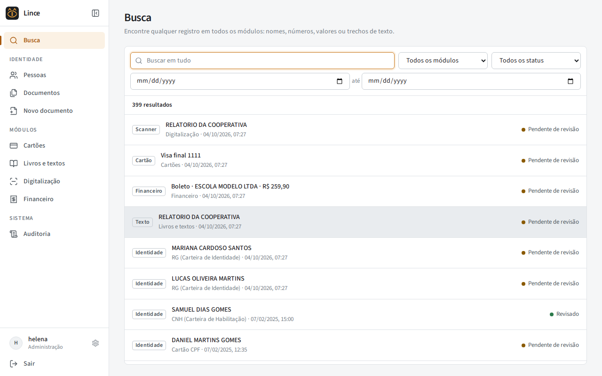
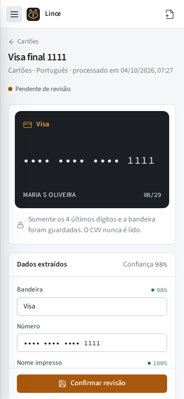
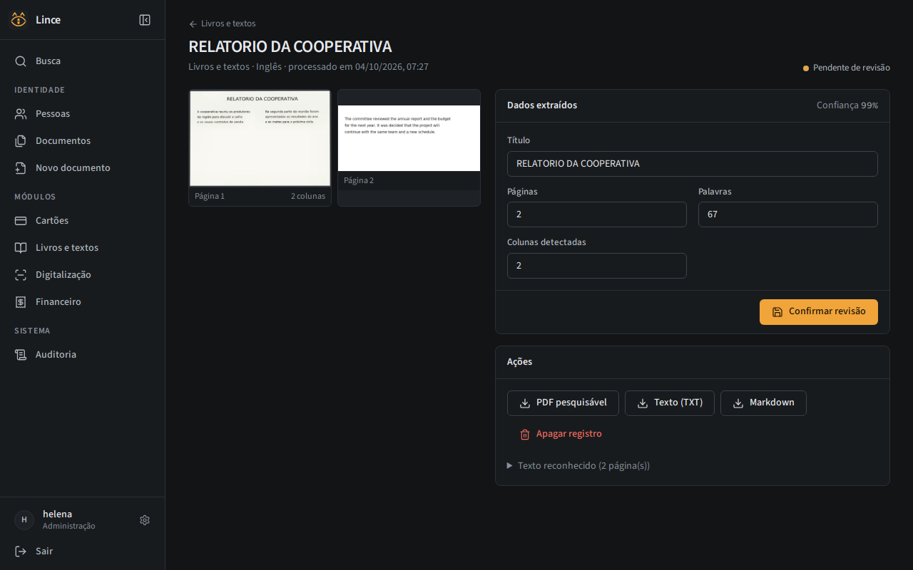
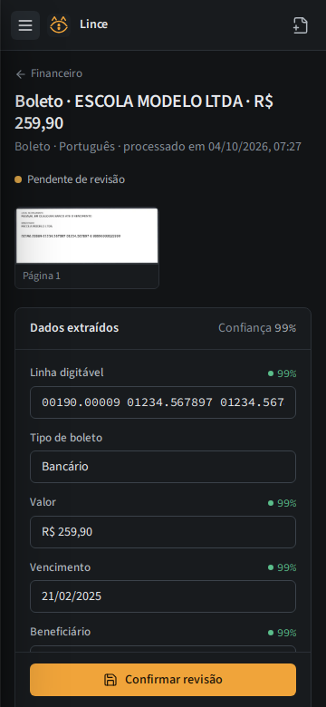
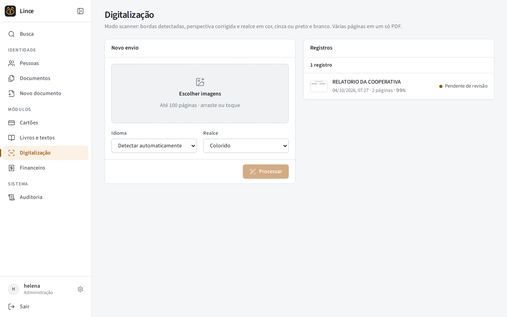

<p align="center">
  
</p>

<p align="center">
  Plataforma de OCR modular e local: documentos de identidade, cartões, livros, digitalização e financeiro em um só lugar.
</p>

<p align="center">
  
</p>

O Lince lê imagens de qualquer tipo de documento, extrai o que importa, valida o que pode ser validado e deixa tudo pesquisável, sem enviar nada para fora do servidor. Cada tipo de leitura é um módulo independente, com pipeline, parser e validadores próprios.

Ele nasceu de uma cópia do Registra, o leitor de documentos de identidade, e evolui separadamente.

## Telas

| Desktop | Celular |
| --- | --- |
|  |  |
|  |  |
|  | |

## Módulos

**Documentos de identidade**
RG, CNH, cartão CPF, passaporte (MRZ ICAO com dígitos verificadores), título de eleitor (dígito verificador e UF) e certidões civis (matrícula de 32 dígitos e tipo de certidão). Pessoas consolidadas por CPF, revisão campo a campo, recortes de foto, assinatura e polegar, e link público para o próprio titular enviar o documento.

**Cartões de crédito e débito**
Bandeira, número, nome impresso e validade, com verificação de Luhn. O número aparece sempre mascarado. O CVV nunca é lido, guardado ou exibido: o texto próximo de rótulos de segurança é descartado antes de qualquer processamento, e a foto do cartão não é armazenada. Por padrão só ficam a bandeira e os 4 últimos dígitos; guardar o número completo é opcional e usa uma chave própria (`LINCE_CARD_ENCRYPTION_KEY`), separada da chave das imagens.

**Livros e documentos longos**
Várias páginas por envio, detecção de colunas e de títulos, ordem de leitura e exportação para PDF pesquisável (imagem com camada de texto invisível), TXT e Markdown.

**Digitalização**
Captura pela câmera do aparelho ou por arquivo, detecção automática das bordas, correção de perspectiva e realce em cor, escala de cinza ou preto e branco. Várias páginas viram um único PDF; o original é guardado sem alteração.

**Financeiro**
Boleto bancário e de arrecadação (linha digitável com todos os dígitos verificadores, valor e vencimento), nota fiscal (chave de acesso validada, emitente, número, série, valor), cupom fiscal, cartão CNPJ (CNPJ validado, razão social, situação, atividade) e comprovante de residência (titular, endereço, CEP, emissor, referência). O tipo é identificado automaticamente.

**Idiomas**
Detecção automática do idioma e da escrita. Português, inglês, espanhol, francês, alemão e italiano usam o pacote latino; russo, chinês, japonês, coreano, árabe e hindi têm pacotes próprios, baixados no primeiro uso. Os idiomas ativos ficam nas configurações.

## Recursos gerais

- Busca global em todos os módulos, com filtros por tipo, status e período
- Revisão manual de cada campo extraído, com a confiança do OCR indicada
- Auditoria de todas as ações, inclusive visualizações e exportações, com IP e horário no fuso configurado
- Login com sessão persistente e renovação automática, lista de sessões ativas e encerramento remoto
- Imagens criptografadas com AES-256-GCM e exclusão completa de registros
- Interface responsiva com tema claro e escuro

## Arquitetura

```
app/
  modules/        um arquivo por módulo, registrado com @register_module
    base.py       contrato do módulo e contexto de processamento
    reading_order.py  colunas, blocos e ordem de leitura
  parsers/        parsers de documentos de identidade
  ocr/            motor, pacotes de idioma e orientação
  validators/     CPF, CNPJ, Luhn, boletos, NF-e, título, certidão, datas
  services/       registros, exportações, pessoas, auditoria, configurações
  web/            API
frontend/         interface em React
migrations/       migrations versionadas (Alembic)
```

Os dados genéricos ficam na tabela `records` (campos de cada módulo em JSON) e em `record_pages`; o módulo de cartões usa também a tabela `card_details`, e os documentos de identidade mantêm `people` e `documents`.

Para criar um módulo novo, adicione um arquivo em `app/modules/` com uma classe que herda de `OcrModule`, implemente `process` e registre com `@register_module`. A API, a busca global e a interface passam a exibi-lo.

## Instalação com Docker

```bash
git clone <url-do-repositorio> lince
cd lince
cp .env.example .env
docker compose run --rm --no-deps app python -m app.cli generate-key
```

Preencha `LINCE_ENCRYPTION_KEY` e `LINCE_SECRET_KEY` com chaves geradas. Para permitir guardar números de cartão, gere também `LINCE_CARD_ENCRYPTION_KEY` e ative a opção nas configurações.

```bash
docker compose up -d --build app
docker compose exec app python -m app.cli create-user admin
```

A aplicação fica em `http://127.0.0.1:8091`. Para acesso pela rede local, defina `LINCE_BIND=0.0.0.0`. Para a internet, use um proxy com HTTPS.

## Execução local

Requisitos: Python 3.12 e Node.js 22.

```bash
python -m venv .venv
source .venv/bin/activate
pip install -e ".[ocr,dev]"
alembic upgrade head
python -m app.cli create-user admin
cd frontend && npm ci && npm run build && cd ..
uvicorn app.main:create_app --factory --port 8091
```

## Testes

```bash
docker compose --profile tests run --rm --build tests
```

Os testes usam apenas dados fictícios: cartões de teste das bandeiras, linhas digitáveis e chaves de NF-e geradas com dígitos corretos, o espécime de passaporte da ICAO e páginas renderizadas para o OCR real (duas colunas, boleto, cartão com CVV impresso, inglês e russo).

## Roadmap

- Detecção das bordas em tempo real na pré-visualização da câmera
- Leitura de código de barras e QR Code de boletos e NFC-e
- Agrupamento de páginas de um livro em capítulos
- Exportação do cadastro e dos registros em CSV
- Perfis de acesso por módulo

## Licença

[MIT](LICENSE)
