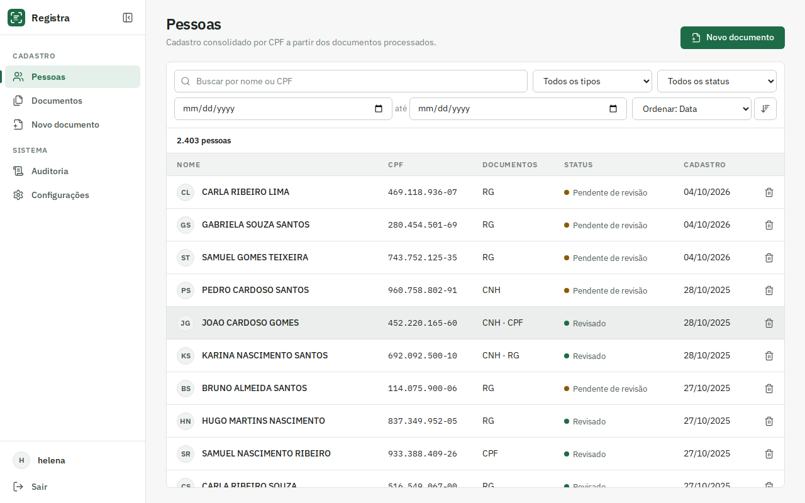
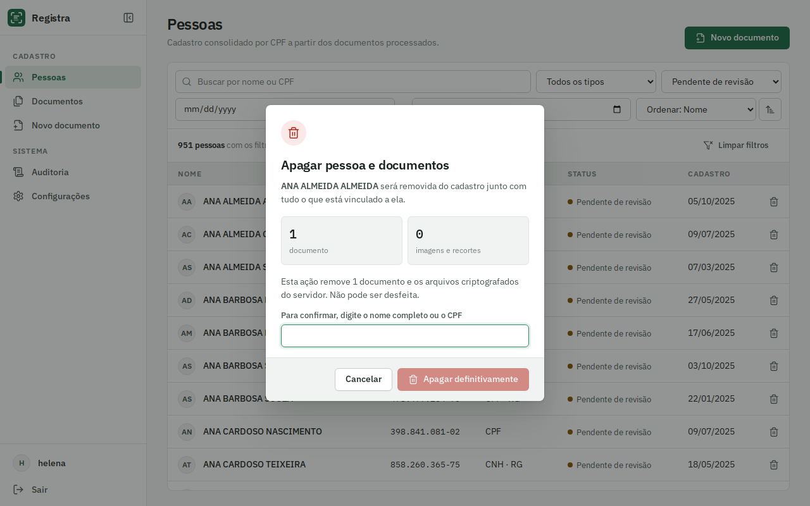
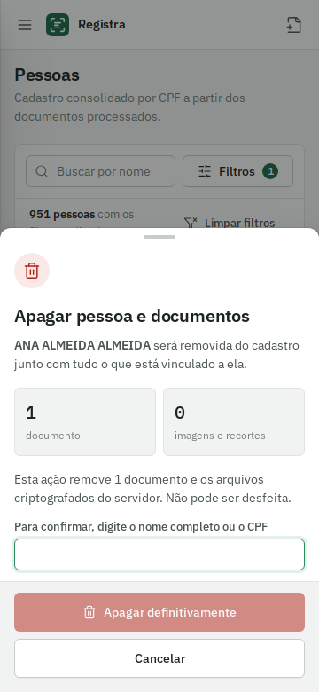

<p align="center">
  
</p>

<p align="center">
  Leitura de documentos de identidade brasileiros com revisão manual, rodando inteiramente no seu servidor.
</p>

<p align="center">
  
</p>

O Registra recebe a foto da frente e do verso de um RG, CNH ou cartão CPF, corrige perspectiva e orientação, extrai os campos com OCR, valida o que for possível e apresenta tudo para conferência antes de salvar. Os dados são consolidados por pessoa, deduplicados pelo CPF, prontos para alimentar fluxos de admissão ou cadastro de clientes.

Nenhuma imagem ou dado sai do servidor: o OCR roda localmente e os arquivos são gravados criptografados.

## Telas

| Desktop | Celular |
| --- | --- |
|  |  |
|  |  |
|  |  |

## Recursos

**Leitura**
- RG (modelos estaduais antigos e o modelo novo), CNH (incluindo a MRZ do verso) e cartão CPF
- Identificação automática do tipo de documento
- Correção de perspectiva, detecção de orientação e realce de contraste antes do OCR
- Leitura ancorada nos rótulos impressos, com cada lado do documento tratado separadamente
- Recorte automático de foto, assinatura e polegar
- Campos complementares do RG: DNI, título de eleitor, CTPS, NIS/PIS, CNS, CNH, registro civil e outros

**Validação**
- Dígito verificador do CPF, com nova leitura da região quando o valor não fecha
- Datas, coerência entre datas e campos obrigatórios por tipo de documento
- Confiança do OCR por campo, indicada na tela de revisão

**Cadastro**
- Pessoas consolidadas por CPF, com todos os documentos vinculados
- Busca por nome ou CPF, filtros por tipo, status e período, ordenação e paginação no servidor
- Filtros refletidos na URL, para compartilhar ou recarregar sem perder o contexto
- Exclusão completa de documento ou pessoa, com confirmação digitada para exclusões em lote
- Registro de auditoria de acessos e alterações

**Segurança e privacidade (LGPD)**
- OCR local com PaddleOCR, sem serviços externos
- Imagens originais, processadas e recortes criptografados com AES-256-GCM
- Login com senhas em argon2, sessão em cookie `HttpOnly` e `SameSite=Strict`, limite de tentativas e proteção contra CSRF

**Interface**
- React com tema claro e escuro, navegação lateral recolhível e menu em gaveta no celular
- Atualização automática das listas quando documentos chegam de outro aparelho

## Instalação com Docker

Requisitos: Docker e Docker Compose.

```bash
git clone <url-do-repositorio> registra
cd registra
cp .env.example .env
```

Gere as duas chaves e preencha `GREEN_OCR_ENCRYPTION_KEY` e `GREEN_OCR_SECRET_KEY` no `.env`:

```bash
docker compose run --rm --no-deps app python -m app.cli generate-key
```

Suba a aplicação e crie o primeiro usuário:

```bash
docker compose up -d --build app
docker compose exec app python -m app.cli create-user admin
```

A aplicação fica em `http://127.0.0.1:8090`. Para acessar de outros aparelhos da rede, defina `GREEN_OCR_BIND=0.0.0.0` no `.env`. Para expor na internet, coloque um proxy com HTTPS na frente.

> Guarde a `GREEN_OCR_ENCRYPTION_KEY` em local seguro. Sem ela as imagens não podem ser lidas.

## Execução local, sem Docker

Requisitos: Python 3.12 e Node.js 22.

```bash
python -m venv .venv
source .venv/bin/activate
pip install -e ".[ocr,dev]"
alembic upgrade head
python -m app.cli create-user admin

cd frontend
npm ci
npm run build
cd ..

uvicorn app.main:create_app --factory --port 8090
```

Para desenvolver a interface com recarga automática, rode `npm run dev` dentro de `frontend/`; as chamadas para `/api` são encaminhadas para a porta 8090.

## Testes

```bash
docker compose --profile tests run --rm --build tests
```

A suíte cobre validadores (CPF, datas, regras por documento), parsers com layouts fictícios, MRZ, criptografia, migrations, pré-processamento de imagem, API, autenticação e o pipeline completo com o OCR real sobre um RG fictício fotografado em perspectiva.

Para popular uma instância de demonstração com milhares de cadastros fictícios:

```bash
docker compose exec app python scripts/seed_demo.py --username admin --password '<senha>'
```

## Estrutura

```
app/
  auth/        login, sessões e limite de tentativas
  db/          modelos SQLAlchemy
  imaging/     pré-processamento e recortes
  ocr/         motor de OCR e detecção de orientação
  parsers/     um parser por tipo de documento, classificador e MRZ
  services/    processamento, revisão, exclusão e consultas paginadas
  storage/     armazenamento criptografado
  validators/  CPF, datas e regras
  web/         API
frontend/      interface em React
migrations/    migrations versionadas (Alembic)
scripts/       dados de demonstração e capturas de tela
tests/
```

Para adicionar um novo tipo de documento, crie um parser em `app/parsers/` com `@register`, declare os campos e as palavras-chave de identificação. O pipeline, a API e a interface passam a usá-lo sem outras mudanças.

## Roadmap

- Passaporte e RNE usando o parser de MRZ já existente
- Leitura do QR Code da CNH digital
- Módulo de admissão: vagas, empresas e status do processo vinculados às pessoas
- Exportação do cadastro em CSV
- Usuários com perfis de acesso diferentes

## Licença

[MIT](LICENSE)
